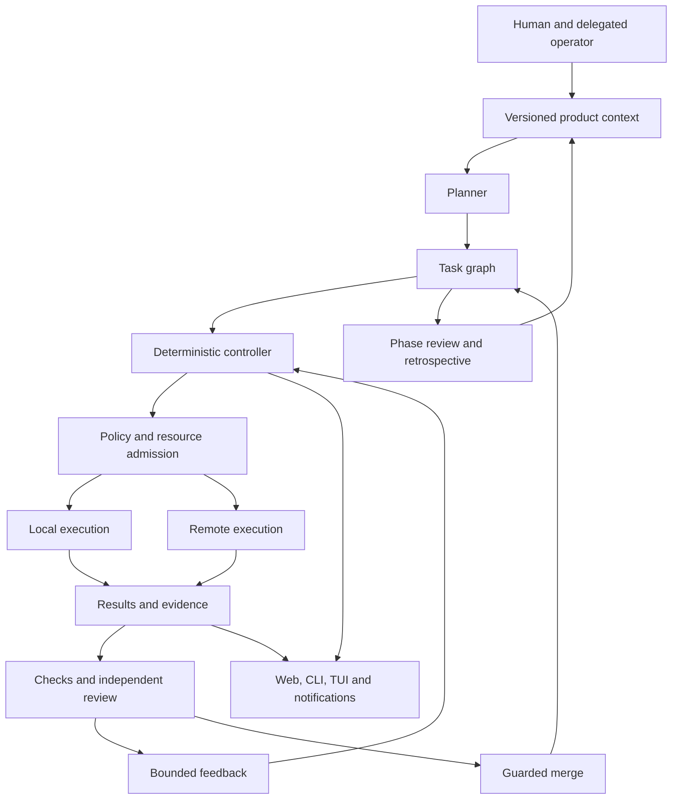

# System architecture and design

## Purpose

Context-garden turns a maintained body of product context into reviewed development
work. A person describes what a product is for, the principles it follows, and the
outcomes it should achieve. Agents plan and implement bounded tasks. A deterministic
controller coordinates execution, verification, feedback and completion. The human
spends attention on product judgment and meaningful exceptions rather than repeatedly
reconstructing the state of a coding session.

The unit of coordination is a task with a clear outcome, an explicit reading list,
dependencies and acceptance criteria. The unit of execution is an attempt against
identified source. The unit of delivery is reviewed code or documentation whose
provenance can be followed from the task through its checks and merge. These units
are related, but they are not interchangeable: starting a process is not completing
an attempt, and merging a change is not deploying it.

This specification defines the overall system and its design contract. The product
context is durable and evolves as experience improves the design. Phase documents
record bounded bodies of work; product-level specifications describe the system as
a whole and remain useful beyond the phase in which a feature was introduced.

## Architectural shape

The controller is responsible for ordering, admission, state transitions and recovery.
It does not need an LLM to decide whether a lease has expired, a dependency is complete,
a check belongs to the current head, or a revision budget remains. Model calls are
explicit jobs: planning, implementation, review, investigation or retrospective work.
A model job can propose an action or outcome; the controller validates and records it.

The web application and scheduler may run in separate processes. They share the same
persisted state and coordination rules. A slow repository operation or expensive
background scan must not make the operator interface unusable. Separating processes
improves responsiveness, but correctness still depends on disciplined state access,
short critical sections and consistent invalidation of derived views.

## Product context and the task graph

A garden contains principles and one or more products. Each product has an overview,
product-level specifications, phase goals, task files and supporting documents. The
context repository is reviewable in ordinary source control and can itself be treated
as a product whose edits go through the same workflow.

A product overview states the audience, purpose and constraints. A specification
explains behavior, architecture and design decisions. A phase selects a coherent set
of outcomes. A task turns one outcome into a bounded assignment, including what to
read, what to change, how completion can be judged, and what it depends on.

The planner reads this context and drafts a dependency graph. Approval checks that a
task is meaningful, scoped, understandable and executable within its phase. Missing
reading paths, ambiguous acceptance criteria, duplicate ownership and dependency
cycles are planning problems to resolve before dispatch. Approving a task does not
silently expand access, spending limits or the phase's scope.

Reading manifests are part of the contract. Brief construction resolves the relevant
source and context, includes the task's criteria and previous feedback, and respects
size budgets without silently losing decisive information. A revision brief must
carry the actual substantive findings, including applicable unresolved feedback from
earlier PR revisions. An operator summary supplements that evidence rather than
replacing it.

## State, identity and authority

The proposed [multiplayer extension](multiplayer.md) applies this authority model to
separate users running local applications, with one shared coordination authority.
Its Phase 10 plan is not a claim about the currently implemented single-controller
runtime.

The system separates authored context, mutable control state, immutable attempt
evidence and derived presentation. Task files describe the work and its lifecycle.
Control state records scheduling decisions, active operations, holds and overrides.
Run records identify individual attempts. Events explain the transitions that connect
these records. Views can cache or summarize them, but must not become a competing
source of authority.

Task, run, claim and source identities solve different problems:

- A task identity persists across implementation and review rounds.
- A run identity identifies one bounded attempt, including its runner and mode.
- A claim generation and token identify the worker authorized to act on a remote run.
- A source revision identifies the bytes a worker, check or reviewer evaluated.
- An external operation identity makes provisioning or publication retries resumable.

The controller is the sole authority for task status. Workers return structured
outcomes and evidence; they cannot approve themselves, rewrite scheduler state or
manufacture a successful check. Operator actions use the same guarded transition
paths as normal scheduling, with explicit attribution.

Concurrent readers must not dirty absent state. Mutations reload relevant state under
the coordination lock and check that their preconditions still hold. File updates
must be atomic or recoverable, and task edits must detect conflicting revisions.
Corrupt state must produce a visible recovery condition while preserving its bytes;
it must not be silently interpreted as an empty garden and overwritten.

## Planning and execution loop

The controller repeatedly collects completed work, reconciles external evidence,
releases expired reservations, advances eligible tasks and admits new jobs. Reaping
existing work and restoring truthful state remain possible when new dispatch is
paused. Holds should be scoped to the relevant task, harness, environment or operation
rather than stopping unrelated work unnecessarily.

A task progresses through drafting, readiness, execution and review, with explicit
routes for required changes, blocked prerequisites, completion and cancellation.
Runs have their own lifecycle. An infrastructure failure can end a run without
proving that its implementation failed; an approved implementation can still await
checks or merge eligibility.

Each execution receives an isolated workspace, a bounded brief, the selected harness
and model, permitted tools, resource constraints and a deadline. The worker implements
one task, runs proportionate verification, preserves useful changes and returns a
structured outcome. A blocked or no-change outcome is legitimate when supported by
what happened; it must not masquerade as implemented functionality.

Preparation, repository operations and long checks are accounted work. They need
visible progress, bounded waits and cancellation behavior. A setup cache is valid
only for the environment it prepared. A recreated workspace must not inherit a stamp
that incorrectly claims its tools and dependencies still exist.

## Runners, harnesses and model selection

A runner determines where and how a job executes: locally, through a remote worker,
through an SSH-compatible transport, or through an explicitly managed/manual path.
A harness determines how a model interacts with its tools and returns output. Keeping
these concerns separate allows the same task and review contracts to work across
execution environments and model providers.

Difficulty and operating configuration select suitable model capacity. Selection
must be observable on each run. Cost decisions should be evaluated by accepted
outcomes and total feedback cost, not only by the price of one invocation. Escalation
is bounded and tied to demonstrated difficulty or failure rather than repeated
unexplained retries.

Quota and authentication failures belong to the relevant model account or harness.
They pause affected dispatch and retain queued work. A successful probe or authorized
operator recovery can resume the harness. Recovery must not consume an author revision
allowance merely because the account was temporarily unavailable.

Remote execution uses explicit claim authority, periodic heartbeats and durable result
return. A reconnect must identify the same accepted execution instead of starting it
again. Claims must be fenced by generation, and terminal authority rejection must stop
surviving execution and its descendants. A deadline remains absolute across restarts;
lease renewal is not permission to extend an execution or a host's expiry.

## Worker pools and resource management

Worker pools provide capacity with a lifecycle: acquire, prepare, verify, admit work,
drain and release. Pool adapters separate provider-specific operations from scheduler
policy. Logical aliases identify workers in ordinary context; private connection
settings are resolved at the execution boundary.

Readiness is evidence that the intended source, runtime, tools, permissions and
capacity are available. A running machine or live daemon alone is insufficient. A
compatible warm worker should be reused when its previous work is terminal and its
workspace is reconciled. Provisioning must use idempotent operation identities and
must not block the controller's normal loop.

Admission combines global concurrency, local execution capacity, review capacity,
per-host constraints and resource-specific limits such as heavy-check slots. Logical
limits complement physical CPU, memory, disk and process controls. Capacity reservations
must be released safely after failure, and reported utilization must distinguish
queued claims, accepted claims, real execution and result collection.

Absolute host deadlines, fleet-size limits and spending authority are independent
constraints. Neither saved credentials nor a scheduling retry authorizes extra hosts
or a longer operating window. Shutdown and interruption handling preserve source,
results and partial transcripts while respecting those constraints.

## Verification, review and merge

Verification is proportionate to the changed behavior. Focused tests, code inspection,
protocol integration, provider fakes or an application journey can establish the
necessary outcome. Live canaries are optional. A missing optional artifact, generic
checklist or cosmetic prose preference alone must not block useful work.

Real defects, failed applicable checks, contradictory source claims and substantive
review rejection remain actionable. The reviewer evaluates the actual proposed head
and the evidence available for it, explains concrete problems and supplies feedback
that an author can act on. Review does not become more trustworthy merely by repeating
it on an unchanged head to reach an arbitrary count.

CI integrations normalize external status while preserving provider identities and
original results. A passing check must apply to the source being considered. Missing,
stale, running and failed checks remain distinct. Testing a synthetic merge tree is
not the same as testing the PR head, and the system must retain that provenance.

Before merge, verify current head, applicable CI, review lineage, dependencies,
conflicts and policy. Use an atomic head guard and serialize merges. Advancing the
base branch alone does not require another rebase or build when the approved current
head remains eligible; stricter base policies can be explicit configuration.

Branch rewrites have one owner. An external stacking tool and the controller must not
independently restack the same branches. Completion reconciles the actual merge and
its content with the task, recording whether the merge was automated or performed
by a person. Release and deployment are separate operations with their own provenance.

## Feedback, recovery and operator attention

The system should resolve routine waiting and retry decisions deterministically.
Transport interruptions, admission failures, interrupted checks and stale bookkeeping
need classified recovery paths. Implementation defects need targeted revisions that
preserve useful code and original failures. Repeating the same attempt without changing
the diagnosed prerequisite is not recovery.

Revision and attempt limits bound work. When a limit is reached, inspect progress,
feedback delivery and the current blocker before granting a specific continuation.
A used revision budget limits another author attempt; it does not invalidate an
otherwise approved and eligible head. Stale threshold bookkeeping must not discard
an unused allowance or repeatedly recreate the same stop.

The Inbox is the operator's decision surface. It distinguishes genuine decisions,
review and CI waits, environment recovery and intentional deferrals. Taking ownership
of an item does not remove its visible action until the relevant state is actually
resolved. Deferrals preserve their reason and dependency without being presented as
an unexplained emergency.

Notifications report meaningful changes and required action, with bounded delivery,
approved destinations and safe handling of worker-authored text. The controller and
its UI remain useful when notification delivery fails.

## Security and enterprise integration

Context, PR comments, tool output and generated artifacts are untrusted inputs to
execution. None can grant themselves new authority. Worker identities must be scoped
to their role; operator controls and controller state require a separate trust boundary.
Filesystem isolation, configuration allowlists and network policy work together rather
than relying on instructions in a prompt as the only boundary.

Configuration separates shareable product policy from private endpoints, credentials
and physical infrastructure identifiers. Secrets must not appear in task logs, briefs,
reports or notifications. Active content needs safe preview isolation. External CI,
source-control, identity and tool integrations must fail closed when their required
permissions or capabilities are unavailable.

The [enterprise environment specification](enterprise-environment.md) expands the
contracts for managed workspaces, private integrations, identity and evidence handling.
Platform-specific enforcement needs capability checks and supported alternatives;
Linux, macOS and Windows through WSL are supported design targets.

## Evidence, observability and costs

Evidence should let a reader reconstruct what happened without having to trust a
summary. Preserve source identity, run and claim identity, checks, reviews, original
failures and recovery decisions. Durable attempt-scoped transcripts make interrupted
or superseded work inspectable, subject to access control and redaction.

Operational views distinguish daemon health from actual execution, and execution
completion from durable result receipt. Cached snapshots must remain sensitive to
mutations that change task eligibility or what the operator needs to see. History
queries and idle claim polling must not repeatedly materialize every historical run
when only active state is relevant.

Cost reporting uses an explicit cohort, time window and completeness statement.
Unknown prices remain unknown. Cost per accepted outcome includes failed and revised
attempts as appropriate, and operator effort is part of the system's real cost.
Targets, measurements and acceptance decisions remain separate: accepting a phase's
outcomes does not rewrite a missed numerical target as a pass.

## Phase review and product learning

A phase closes through review of its delivered outcomes, evidence and remaining
blockers. Persona reviewers bring distinct perspectives to that review: product
value, design coherence, delivery, maintainability, usability, security and the
experience of the intended user. Each voice should produce a substantive narrative
reaction, alongside structured findings suitable for task routing.

The retrospective reconciles those views without erasing disagreements. It links
findings to existing ownership, drafts missing work, preserves explicit scope decisions
and records the closure verdict. Task approval checks relevance, duplication, scope,
readings and dependencies rather than blindly accepting every suggestion. Product
specifications are updated when these lessons change the design.

The [persona review specification](persona-reviews.md) defines the narrative and
structured parts of this process. Release preparation follows accepted source and
recorded closure requirements; a successful retrospective is not itself evidence of
publication, deployment or an expanded infrastructure budget.

## Design tensions

Several boundaries need continued care: a simple file-backed system must remain safe
under concurrent writers; fast summaries must not hide evidence or become stale;
flexible integrations must not turn configuration into unrestricted authority; and
automation must reduce operator attention without concealing failures.

The design should address these tensions directly. Prefer explicit identities,
small guarded transitions, durable evidence, narrow adapters and understandable
recovery over hidden heuristics or a second model continuously interpreting state.
A system that cannot explain why it is waiting or what it accepted is not dependable,
even when its individual workers produce useful code.
